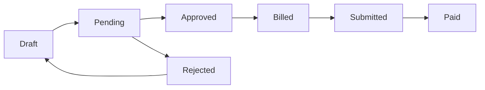

An activity in CoordHub is a record of support coordination work you've done for a participant. Activities are the link between your time and your billing — every invoice you create is built from approved activities.

## Billable vs. non-billable

Not every activity generates an invoice. When you log an activity, you assign it to a support item:

- **Billable activities** use an NDIS support item (e.g. Support Coordination 07_002_0106_8) and draw from the participant's plan budget
- **Non-billable activities** use a non-billing activity type (e.g. internal admin, travel that isn't claimed) and don't generate a charge

## The approval workflow

Activities move through a set of statuses from creation to payment:

| Status | Meaning |
|---|---|
| <Badge variant="secondary">Draft</Badge> | Created but not submitted for approval — only you can see it |
| <Badge variant="warning">Pending</Badge> | Submitted and waiting for a manager to approve |
| <Badge variant="success">Approved</Badge> | Approved — ready to be included in an invoice |
| <Badge>Billed</Badge> | Included in a created invoice |
| <Badge>Submitted</Badge> | PRODA claim lodged with the NDIA, or invoice sent to plan manager |
| <Badge variant="success">Paid</Badge> | Payment received and recorded |
| <Badge variant="destructive">Rejected</Badge> | Returned to the coordinator with a note — must be corrected and resubmitted |

Standard coordinators submit activities; senior coordinators, administrators, and owners approve them. Once an activity is approved, it can't be edited — only the administrator can return it to draft.

## Case notes

Every activity has a case note field. The case note is your clinical record of what happened during that support session — it's distinct from the billing record but stored alongside it. Case notes are included in activity exports and NDIA progress reports.

A good case note records: what you did, who was involved, decisions made, actions taken, and what happens next. See [What makes a good case note?](/activities/logging-an-activity#what-makes-a-good-case-note) for examples.

<Tip>
  The Activities section has three views: **All** (org-wide, managers only), **Pending** (awaiting your approval), and **Timers** (currently running timers). Coordinators default to seeing their own activities only.
</Tip>

<AccordionGroup>
  <Accordion title="Common questions">
    **How far back can I log activities?**
    There's no hard date restriction in CoordHub, but NDIS billing rules mean you can only claim activities that fall within the participant's current plan period. Activities dated before the plan start date or after the plan end date will not appear in PRODA exports or invoice creation.

    **Can I log an activity for a participant without a plan?**
    Yes — non-billable activities can be logged without a plan. Billable activities require an active plan with a matching support category budget. If you try to select a support item and no options appear, the participant likely doesn't have a matching plan budget set up.

    **What happens if an activity is rejected?**
    It returns to Draft status with a note from the approver explaining what needs to be corrected. You can edit it and resubmit. The rejection is recorded in the activity's audit history.
  </Accordion>
</AccordionGroup>
