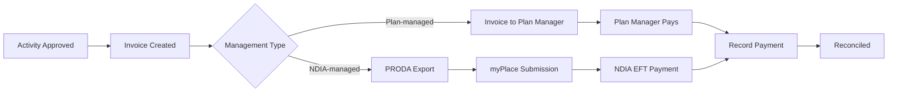

The Finance section brings together everything related to billing and payment for NDIS support coordination services. It connects directly to the activities you've logged and the plan budgets you've set up.

<Frame>
  
</Frame>

## The billing workflow

Activities flow through Finance in a predictable sequence:

Understanding this flow helps you troubleshoot billing issues — if a participant's budget shows spend but no payment, trace where in the flow the activity is stuck.

## Finance hub

Go to **Finance** in the sidebar to open the finance hub. The top of the page shows five KPI cards:

| Card | What it shows |
|---|---|
| **Total Billed** | All invoices sent (regardless of payment status) |
| **Total Paid** | Invoices with a recorded payment |
| **PRODA Pending** | NDIA-managed claims generated but not yet uploaded to the NDIA portal |
| **NDIA Reconciled** | PRODA claims confirmed as paid by the NDIA |
| **Outstanding** | Invoices sent but not yet paid |

## Finance sections

| Section | What's here |
|---|---|
| **Invoices** | All invoices — create, view, send, download PDF |
| **Claims** | NDIS claims submitted via PRODA, with status tracking |
| **PRODA Export** | Generate and download the PRODA CSV for NDIA-managed participants |
| **Plan Managers** | Directory of plan managers linked to participant budgets |
| **Payments** | Payment records, NDIA payment runs, reconciliation |

## NDIA-managed vs. plan-managed

How an invoice is processed depends on the budget management type:

- **NDIA-managed** participants: You export claims via PRODA and submit directly to the NDIA. The NDIA pays your organisation by bank transfer.
- **Plan-managed** participants: You create a regular invoice and send it to the plan manager. The plan manager pays your organisation and claims from the NDIA on the participant's behalf.

Most Finance pages in CoordHub clearly distinguish between these two flows. The PRODA export only includes NDIA-managed claims.

<Tip>
  The budget management type is set on each individual plan budget — a participant can have some NDIA-managed budgets and some plan-managed budgets within the same plan. CoordHub routes each invoice correctly based on the budget the activity drew from.
</Tip>
