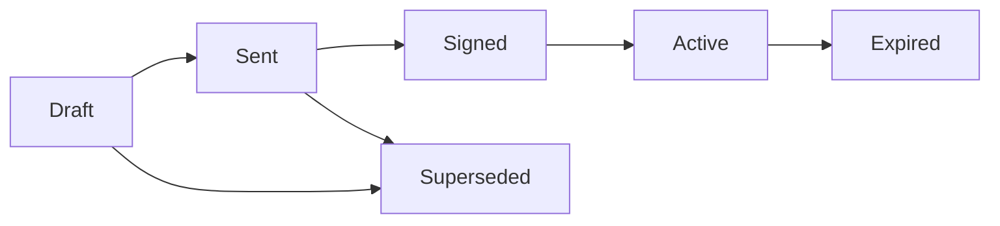

A service agreement is the formal document between your organisation and a participant (or their representative) that sets out what support coordination services will be provided, under what conditions, and at what rates.

## Service agreements in CoordHub

CoordHub creates service agreements from the participant's intake record — the details you've already captured flow through into the agreement, reducing re-entry. Each agreement is linked to a specific NDIS plan period.

## Status lifecycle

| Status | Meaning |
|---|---|
| **Draft** | Being prepared — not yet sent to the participant |
| **Sent** | Provided to the participant or their representative for signing |
| **Signed** | Returned with a signature — document uploaded to CoordHub |
| **Active** | Current, signed service agreement in effect |
| **Expired** | Plan period has ended or a new agreement supersedes this one |
| **Superseded** | Replaced by a new version before being signed |

## What a service agreement covers

A CoordHub service agreement includes:
- Participant details (name, NDIS number, date of birth)
- Organisation details (your organisation's name, ABN, NDIS registration number)
- Support items and rates (line items from the NDIS Price Guide)
- Plan period dates
- Consent and privacy statements
- Signature section for participant / representative

## What must a service agreement include?

Under the NDIS (Registered Supports) Rules 2018, a service agreement between a registered NDIS provider and a participant must include:

1. The supports to be provided and how they'll be provided
2. The price for each support
3. How the participant can end the agreement (notice period)
4. How the provider can end the agreement (notice period)
5. Any conditions the participant must meet
6. Complaints and dispute resolution process

CoordHub's service agreement template covers these requirements. If your organisation has a customised template that differs from the CoordHub default, confirm with your compliance team that it meets all requirements.

<Info>
  CoordHub uses a manual signing workflow. You create the agreement in CoordHub, print or export it as a PDF, provide it to the participant (or their guardian/nominee) for physical signature, then upload the signed copy back into CoordHub.
</Info>
